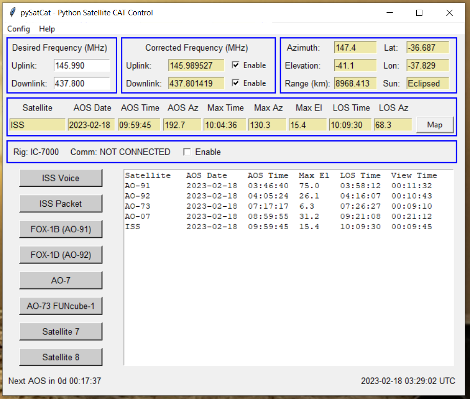

# AB3GY pySatCat
Amateur radio Python application to control a transceiver for satellite operation.

Computes satellite position and applies Doppler shift to uplink and downlink frequencies when the satellite is in view.

Developed for personal use by the author, but available to anyone under the license terms below.

Lots more documentation is needed, please stay tuned.

The main application file is `pySatCat.py`

Also includes `nextPasses.py` which is a script to compute then next N passes of a specified satellite.

## Dependencies
Written for Python 3.x.  Uses tkinter for the GUI.

Requires the `ephem` package from PyPI.  Can be installed using pip.

Requires the `serial` package from PyPI. May need to be installed using pip.

Requires the `PyRigCat` package for CAT control of a transceiver.  Copy this package to a local directory and modify the `_env_init.py` file to point to this package.

Repository: https://github.com/tkerr/ab3gy-PyRigCat

This package has been tested on Windows 10 PCs. Other operating systems have not been tested.

## Author
Tom Kerr AB3GY
ab3gy@arrl.net

## License
Released under the 3-clause BSD license.
See license.txt for details.

## Screenshots

### Main window:

### Map window:

